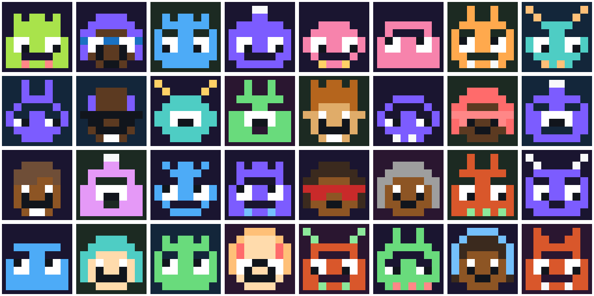
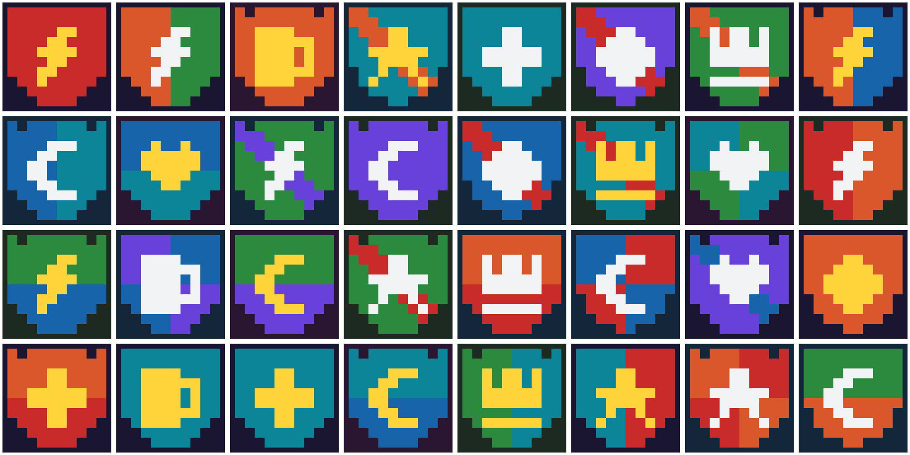
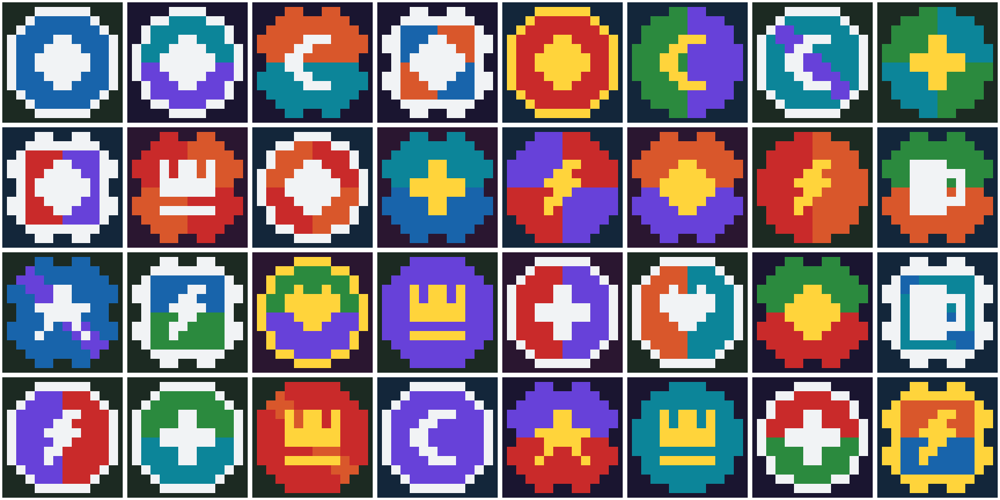

# gsichtl

Deterministic pixel-art avatars from any seed. *Gsichtl* is Bavarian for
"little face".







The seed is any byte string, typically a public user or group id. The same
seed always gives the same picture, so every client draws it locally and
nothing has to be stored or sent. The crate does no I/O, is
`#![forbid(unsafe_code)]` and has one dependency, `blake3`, plus `png` behind
an optional feature.

## Generators

- `gsichtl::monster(seed)`: an 8x8 monster with antennae, horns or ears, big
  eyes and a mouth. Up to 324,000 monsters: 4 backgrounds, 10 bodies,
  6 accents, 6 tops, 3 silhouettes, 3 brows, 5 eyes and 5 mouths.
- `gsichtl::nerd(seed)`: an 8x8 human face with hair, glasses or goggles and
  sometimes headphones. Up to 1,327,104 nerds: 4 backgrounds, 6 skins,
  8 hair colors, 3 frames, 6 accents, 2 heads, 6 hair styles, 4 eyes,
  4 mouths and with or without headphones.
- `gsichtl::face(seed)`: a monster or a nerd, chosen by the seed (about half
  each). It is not necessarily `monster(seed)` or `nerd(seed)`.
- `gsichtl::crest(seed)`: a 10x10 shield with a division and an emblem, for
  groups. 28,800 crests: 4 backgrounds, 6 fields, 5 second fields, 2 metals,
  3 shields, 5 divisions and 8 emblems.
- `gsichtl::badge(seed)`: a 12x12 round badge (disc, octagon or cog) with a
  division, an emblem and sometimes a metal rim, for groups. 57,600 badges:
  4 backgrounds, 6 fields, 5 second fields, 2 metals, 3 shapes, with or
  without a rim, 5 divisions and 8 emblems.

The face counts are upper bounds: where no part uses the accent color, two
faces that differ only in their accent look the same.

## Installation

```toml
[dependencies]
gsichtl = "0.1"
```

For PNG output, turn on the `png` feature:

```toml
[dependencies]
gsichtl = { version = "0.1", features = ["png"] }
```

## Usage

Render to RGBA8:

```rust
let avatar = gsichtl::face(b"alice");
// 12 px per cell, 16 px of background around the grid: 128 x 128 RGBA8.
let image = avatar.to_rgba(12, 16);
assert_eq!((image.width, image.height), (128, 128));
```

Draw the cells yourself:

```rust
let a = gsichtl::crest(b"community-7");
for y in 0..a.side() {
    for x in 0..a.side() {
        let color = a.cell(x, y).unwrap_or(a.background());
        // Fill the square at (x, y) with `color`, an sRGB `[u8; 3]`.
    }
}
```

Encode as PNG, with the `png` feature:

```rust
let png = gsichtl::face(b"alice").to_png(16, 8)?;
std::fs::write("alice.png", png)?;
```

An image is `side * cell_px + 2 * margin_px` pixels wide and high, at most
3060. `cell_px == 0` gives a plain square of background.

## How it works

The seed goes through BLAKE3 in derive-key mode, with one context string per
generator: `gsichtl 2026-10-02 face v1`, `gsichtl 2026-10-02 monster v1`,
`gsichtl 2026-10-02 nerd v1`, `gsichtl 2026-10-02 crest v1` and
`gsichtl 2026-10-03 badge v1`. The extendable output is the stream of draws:
each draw takes 4 bytes, modulo the number of choices. The parts are small
character grids, painted in a fixed order. Eyes, brows and mouths are clipped
to the painted body, so they never leave the silhouette.

BLAKE3 serves as a deterministic mixer here, not for security. Its output is
fixed by its specification, so updating the `blake3` crate does not change a
picture.

## Sample sheets

```sh
cargo run --example render --features png -- <dir> [count]
```

writes `face-NN.png` from the seed `user-N`, and `crest-NN.png` and
`badge-NN.png` from the seed `community-N` into `<dir>`, with 16 px cells and
an 8 px margin. The sheets above are montages of 32 of each:

```sh
magick montage <dir>/face-*.png  -tile 8x -geometry +4+4 -background none docs/faces.png
magick montage <dir>/crest-*.png -tile 8x -geometry +4+4 -background none docs/crests.png
magick montage <dir>/badge-*.png -tile 8x -geometry +4+4 -background none docs/badges.png
```

## Stability

The same seed gives the same avatar within a `0.x` minor version. Changing a
part, a palette, the draw order or a context string is a breaking change and
bumps the minor version, because everyone who draws an avatar for the same id
has to see the same picture. `tests/gsichtl.rs` pins fingerprints of known
seeds.

## Not an identity check

Anyone can upload a picture that looks like another person's generated face.
A generated avatar is a decoration; never present it as verification of who
someone is.

## Minimum Rust version

Rust 1.91, edition 2024.

## License

MIT, see [LICENSE](LICENSE).
